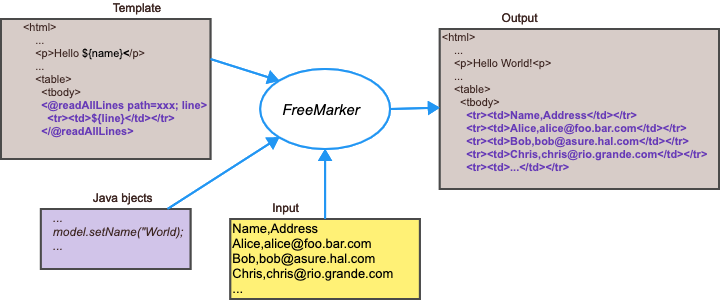

# materialstore

-   [materialstore javadoc](https://kazurayam.github.io/materialstore/api/index.html)

-   back to the [repository](https://github.com/kazurayam/materialstore)

## Introduction to materialstore

## Reporters

## Custom FreeMarker Directives

This project is a collection of FreeMarker user-defined directives
developed by kazurayam.

It was tested with FreeMarker v2.3.31.

### readAllLines

The `readAllLines` directive reads a text file specified by the path parameter,
iterate over all lines in it, generate the templated body.
It will provide a loopVariable that contains the line.

Synopsis

    <@readAllLines path="path to the file" ; line>
      
${line}

    </@readAllLines>

#### Motivation

Let me consider a case where I am going to generate a HTML file
using FreeMarker;
I have a simple text file with some number of lines,
and I want to insert HTML fragment as follows:

            <tr><td> ... line #1 ... </td></tr>
            <tr><td> ... line #2 ... </td></tr>
            <tr><td> ... line #3 ... </td></tr>
            ...

You may be or may not be aware, FreeMarker does not provide a built-in
directive with which I can read a text content from external file, and
transform the lines into HTML fragments.
The following diagram shows the basic how FreeMarker works.

Now I wanted to do something like this:

My custom `readAllLines` directive just enables me to do it.

#### Example

##### Caller Java

**ReadAllLinesDirectivesTest.java**

    package com.kazurayam.materialstore.freemarker;

    import freemarker.template.Template;
    import freemarker.template.TemplateException;
    import org.junit.jupiter.api.Test;

    import java.io.IOException;
    import java.io.StringWriter;
    import java.io.Writer;

    import static org.junit.jupiter.api.Assertions.assertNotNull;
    import static org.junit.jupiter.api.Assertions.assertTrue;

    public class ReadAllLinesDirectiveTest extends TestBase {

        public ReadAllLinesDirectiveTest() throws IOException {
            super();
        }

        @Test
        public void test_execute() throws IOException, TemplateException {
            /* Get the template (uses cache internally) */
            Template temp = cfg.getTemplate("readAllLinesDemo.ftlh");

            /* Merge data-model with template */
            Writer out = new StringWriter();
            temp.process(model, out);

            String output = out.toString();
            assertNotNull(output);
            assertTrue(output.contains("<tr><td>0</td><td>publishedDate,uri,title,link,description,author</td></tr>"));
            System.out.println(output);
        }
    }

##### TestBase.java

The test classes here extends `TestBase.java` which prepares
the configuration of FreeMarker.
Please note that some sharedVariables are declared here,
which includes the name of directives (e.g, `readAllLines`).

**TestBase**

    package com.kazurayam.materialstore.freemarker;

    import freemarker.template.Configuration;
    import freemarker.template.TemplateExceptionHandler;
    import freemarker.template.TemplateModelException;

    import java.io.IOException;
    import java.nio.file.Path;
    import java.nio.file.Paths;
    import java.util.HashMap;
    import java.util.Map;

    public class TestBase {

        protected Configuration cfg;
        protected Map<String, Object> model;

        public TestBase() throws IOException {

            Path projectDir = Paths.get(System.getProperty("user.dir"));

            /* ---------------------------------------------------------- */
            /* You should do this ONLY ONCE in the whole application lifecycle */

            /* Create and adjust the configuration singleton */
            cfg = new Configuration(Configuration.VERSION_2_3_31);

            Path templatesDir = projectDir.resolve("src/test/resources/freemarker_templates");
            cfg.setDirectoryForTemplateLoading(templatesDir.toFile());

            // Recommended settings for new projects:
            cfg.setDefaultEncoding("UTF-8");
            cfg.setTemplateExceptionHandler(TemplateExceptionHandler.RETHROW_HANDLER);
            cfg.setLogTemplateExceptions(false);
            cfg.setWrapUncheckedExceptions(true);
            cfg.setFallbackOnNullLoopVariable(false);
            cfg.setBooleanFormat("c");
            cfg.setOutputEncoding("UTF-8");

            // add custom directives
            try {
                cfg.setSharedVariable("readAllLines", new ReadAllLinesDirective());
                Path store = projectDir.resolve("src/test/fixtures").resolve("store");
                cfg.setSharedVariable("baseDir", store.normalize().toAbsolutePath().toString());
                //
                cfg.setSharedVariable("uppercase", new UpperCaseDirective());
                //
                cfg.setSharedVariable("compressToSingleLine", new CompressToSingleLineDirective());

            } catch (TemplateModelException e) {
                throw new RuntimeException(e);
            }

            /* ---------------------------------------------------------- */
            /* You usually do these for MULTIPLE TIMES in the application life-cycle: */

            /* Create a data-model */
            model = new HashMap<>();
        }
    }

##### Template

**readAllLinesDemo.ftlh**

    <#-- readAllLinesDemo.ftlh -->
    <#-- custom directive name "readAllLines" is defined as a shared variable. See TestBase.java -->
    <#assign x = 0>
    <@readAllLines path="AmznPress/20220310_203757/objects/e96bd4c2e345301b567d70071dcec04fda699ce4.csv"; line>
        <tr><td>${x}</td><td>${line}</td></tr>
        <#assign x++>
    </@readAllLines>

##### Input

-   [sample CSV file](https://github.com/kazurayam/materialstore/blob/main/freemarker/src/test/fixture/store/AmznPress/20220310_203757/objects/e96bd4c2e345301b567d70071dcec04fda699ce4.csv)

##### Output

        <tr><td>0</td><td>publishedDate,uri,title,link,description,author</td></tr>
        <tr><td>1</td><td>Thu Mar 10 20:00:00 JST 2022,31596,"OOO Until TBD? Majority of Canadian Office Workers Want Remote Work to Stay ",https://press.aboutamazon.com/news-releases/news-release-details/ooo-until-tbd-majority-canadian-office-workers-want-remote-work,"Half of Canadian office workers say working mostly/entirely remote is their ideal scenario; only one-quarter prefer mostly/entirely in office Ability to work remotely and flexible work hours are now more important to office workers than workplace culture, development/growth opportunities and","Amazon.com, Inc. - Press Room News Releases"</td></tr>

    ... (trimmed)

### compressToSingleLine

The `compressToSingleLine` directive strips the following text fragments out of the body text.

1.  Leading whitespaces of each lines (`^\s+`)

2.  Traling whitespaces of each lines (`\s*$`)

3.  Line breaks (`\r|\n`)

The whitespaces between the 1st printable character and the last printable character will be preseved
(will not be trimmed).

Empty lines will be ignored.

Consequently the body text will become a single line.

The `compressToSingleLine` directive takes no arguments.

Synopsis

    <@compressToSingleLine>
        <#-- any body text -->
    <@compressToSIngleLine>

#### Motivation

FreeMarker provides a few options of white-space handling.
See [the document](https://freemarker.apache.org/docs/dgui_misc_whitespace.html) for detail.

I was not satisfied with the standard options because I had a very particular requirement for white-space handling.
Let me show you an example.

My template produced this output:

          
                    {&quot;cat&quot;:  &quot;Nikolai, Marcus and Ume&quot;,
    
                     &quot;greeting&quot;:  &quot;Hello, world!&quot;}
    
          

This output was problematic for me because:

1.  I want to trim the indentation spaces before `` in all lines.

2.  I do not want to compress white-spaces inside `` and ``. I mean the 4 white-spaces in side ` {"cat` should be retained.

3.  The output has 6 lines. But I want all `` tags concatinated without line breaks.
    A sequence of `` tags should form 1 single line.
    In other words, I want to remove `\n` and `\r`.

The result I want looks as follows:

        {&quot;cat&quot;:  &quot;Nikolai, Marcus and Ume&quot;,     &quot;greeting&quot;:  &quot;Hello, world!&quot;}

The built-in [&lt;#compress&gt;](https://freemarker.apache.org/docs/dgui_misc_whitespace.html#autoid_30) directory
does sightly different from what I want. So I developed a custom directory `@compressToSingleLine` for me.

#### Example

##### Caller Java

**CompressToSingleLineDirectivesTest.java**

    package com.kazurayam.materialstore.freemarker;

    import freemarker.template.Template;
    import freemarker.template.TemplateException;
    import org.junit.jupiter.api.Test;

    import java.io.BufferedReader;
    import java.io.IOException;
    import java.io.StringReader;
    import java.io.StringWriter;
    import java.io.Writer;
    import java.util.ArrayList;
    import java.util.Arrays;
    import java.util.List;

    import static org.junit.jupiter.api.Assertions.assertEquals;
    import static org.junit.jupiter.api.Assertions.assertNotNull;
    import static org.junit.jupiter.api.Assertions.assertTrue;

    public class CompressToSingleLineDirectiveTest extends TestBase {

        public CompressToSingleLineDirectiveTest() throws IOException {
            super();
        }

        @Test
        public void test_execute() throws IOException, TemplateException {
            /* set data into the model */
            List<String> segments = Arrays.asList(
                    "    {\"cat\":  \"Nikolai, Marcus and Ume\",\n",
                    "     \"greeting\":  \"Hello, world!\"}     \n");
            model.put("segments", segments);

            /* Get the template (uses cache internally) */
            Template temp = cfg.getTemplate("compressToSingleLineDemo.ftlh");

            /* Merge data-model with template */
            Writer out = new StringWriter();
            temp.process(model, out);

            String output = out.toString();
            assertNotNull(output);

            System.out.println("---------------------");
            System.out.println(output);
            System.out.println("---------------------");

            BufferedReader br = new BufferedReader(new StringReader(output));
            List<String> lines = new ArrayList<>();
            String line;
            while ((line = br.readLine()) != null) {
                lines.add(line);
            }
            assertEquals(1, lines.size(), "should be single line");
            assertTrue(lines.get(0).startsWith("<span"),   "^\\s+ should be trimmed");
            assertTrue(output.contains("    {&quot;cat"),
                    "indent of text inside  tags should be preserved");
        }

    }

##### Template

**compressToSingleLineDemoDemo.ftlh**

    <#-- compressToSingleLineDemo.ftlh -->

    <#-- sample markup text will be printed straight -->
    <#--
    <@sampleMarkup />
    -->

    <#-- custom directive name "compressToSingleLine" is defined as a shared variable. See TestVase.java. -->
    <@compressToSingleLine>
      <@sampleMarkup/>
    </@compressToSingleLine>

    <#macro sampleMarkup>
        <#assign clazz="nochange">
        <#list segments>
          
              <#items as segment>
                ${segment}
              </#items>
          
        </#list>
    </#macro>

### Reference

1.  [FreeMarker Programmer’s Guide / The Data Model / Directives](https://freemarker.apache.org/docs/pgui_datamodel_directive.html)

2.  [FreeMarker Manual / Template Author’s Guide / Miscellaneous / Defining your own directives](https://freemarker.apache.org/docs/dgui_misc_userdefdir.html)
