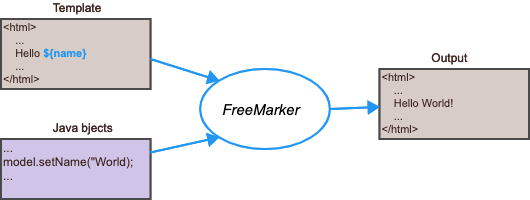

== Custom FreeMarker Directives

This project is a collection of FreeMarker user-defined directives
developed by kazurayam.

It was tested with FreeMarker v2.3.31.

=== readAllLines

The `readAllLines` directive reads a text file specified by the path parameter,
iterate over all lines in it, generate the templated body.
It will provide a loopVariable that contains the line.

Synopsis
----
<@readAllLines path="path to the file" ; line>
  
${line}

</@readAllLines>
----

==== Motivation

Let me consider a case where I am going to generate a HTML file
using FreeMarker;
I have a simple text file with some number of lines,
and I want to insert HTML fragment as follows:

----
        <tr><td> ... line #1 ... </td></tr>
        <tr><td> ... line #2 ... </td></tr>
        <tr><td> ... line #3 ... </td></tr>
        ...
----

You may be or may not be aware, FreeMarker does not provide a built-in
directive with which I can read a text content from external file, and
transform the lines into HTML fragments.
The following diagram shows the basic how FreeMarker works.

Now I wanted to do something like this:

image:images/freemarker/FreeMarker_readAllLines.png[]

My custom `readAllLines` directive just enables me to do it.

==== Example

===== Caller Java

.ReadAllLinesDirectivesTest.java
[source,java]
----
include::../src/test/java/com/kazurayam/materialstore/freemarker/ReadAllLinesDirectiveTest.java[]
----

===== TestBase.java

The test classes here extends `TestBase.java` which prepares
the configuration of FreeMarker.
Please note that some sharedVariables are declared here,
which includes the name of directives (e.g, `readAllLines`).

.TestBase
[source,java]
----
include::../src/test/java/com/kazurayam/materialstore/freemarker/TestBase.java[]
----

===== Template

.readAllLinesDemo.ftlh
[source]
----
include::../src/test/resources/freemarker_templates/readAllLinesDemo.ftlh[]
----

===== Input

- link:https://github.com/kazurayam/materialstore/blob/main/freemarker/src/test/fixture/store/AmznPress/20220310_203757/objects/e96bd4c2e345301b567d70071dcec04fda699ce4.csv[sample CSV file]

===== Output

----
    <tr><td>0</td><td>publishedDate,uri,title,link,description,author</td></tr>
    <tr><td>1</td><td>Thu Mar 10 20:00:00 JST 2022,31596,"OOO Until TBD? Majority of Canadian Office Workers Want Remote Work to Stay ",https://press.aboutamazon.com/news-releases/news-release-details/ooo-until-tbd-majority-canadian-office-workers-want-remote-work,"Half of Canadian office workers say working mostly/entirely remote is their ideal scenario; only one-quarter prefer mostly/entirely in office Ability to work remotely and flexible work hours are now more important to office workers than workplace culture, development/growth opportunities and","Amazon.com, Inc. - Press Room News Releases"</td></tr>

... (trimmed)
----

=== compressToSingleLine

The `compressToSingleLine` directive strips the following text fragments out of the body text.

1. Leading whitespaces of each lines (`^\s+`)
2. Traling whitespaces of each lines (`\s*$`)
3. Line breaks (`\r|\n`)

The whitespaces between the 1st printable character and the last printable character will be preseved
(will not be trimmed).

Empty lines will be ignored.

Consequently the body text will become a single line.

The `compressToSingleLine` directive takes no arguments.

Synopsis
----
<@compressToSingleLine>
    <#-- any body text -->
<@compressToSIngleLine>
----

==== Motivation

FreeMarker provides a few options of white-space handling.
See https://freemarker.apache.org/docs/dgui_misc_whitespace.html[the document] for detail.

I was not satisfied with the standard options because I had a very particular requirement for white-space handling.
Let me show you an example.

My template produced this output:
----
      
                {&quot;cat&quot;:  &quot;Nikolai, Marcus and Ume&quot;,

                 &quot;greeting&quot;:  &quot;Hello, world!&quot;}

      
----

This output was problematic for me because:

1. I want to trim the indentation spaces before `` in all lines.
2. I do not want to compress white-spaces inside `` and ``. I mean the 4 white-spaces in side `    {&quot;cat` should be retained.
3. The output has 6 lines. But I want all `` tags concatinated without line breaks.
A sequence of `` tags should form 1 single line.
In other words, I want to remove `\n` and `\r`.

The result I want looks as follows:

----
    {&quot;cat&quot;:  &quot;Nikolai, Marcus and Ume&quot;,     &quot;greeting&quot;:  &quot;Hello, world!&quot;}
----

The built-in https://freemarker.apache.org/docs/dgui_misc_whitespace.html#autoid_30[<#compress>] directory
does sightly different from what I want. So I developed a custom directory `@compressToSingleLine` for me.

==== Example

===== Caller Java

.CompressToSingleLineDirectivesTest.java
[source,java]
----
include::../src/test/java/com/kazurayam/materialstore/freemarker/CompressToSingleLineDirectiveTest.java[]
----

===== Template

.compressToSingleLineDemoDemo.ftlh
[source]
----
include::../src/test/resources/freemarker_templates/compressToSingleLineDemo.ftlh[]
----

=== Reference

1. https://freemarker.apache.org/docs/pgui_datamodel_directive.html[FreeMarker Programmer's Guide / The Data Model / Directives]
2. https://freemarker.apache.org/docs/dgui_misc_userdefdir.html[FreeMarker Manual / Template Author's Guide / Miscellaneous / Defining your own directives]
