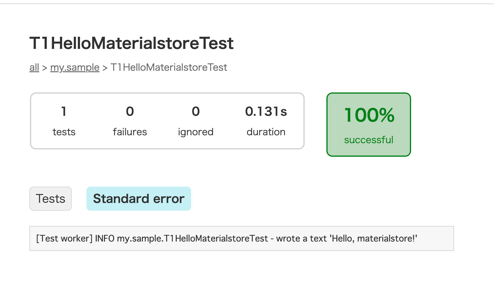
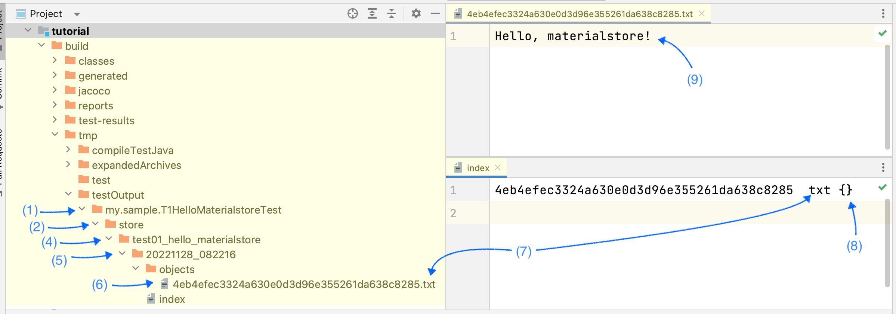

Let us begin with a quick introduction to a Java library named "materialstore".

== Setting up a project

Here I assume you have a seasoned programming skill in Java, and you have installed the build tool link:https://gradle.org/install/[Gradle]. Now let us create a project where you write some Java code for practice.

Let us create a working directory; say `~/tmp/sampleProject`.

[source, shell]
----
$ cd ~/tmp/
$ mkdir sampleProject
----

You want to initialize it as a Gradle project, so you would operate in the console as this:

[source, shell]
----
$ cd ~/tmp/sampleProject
$ gradle init

Select type of project to generate:
  1: basic
  2: application
  3: library
  4: Gradle plugin
Enter selection (default: basic) [1..4] 1

Select build script DSL:
  1: Groovy
  2: Kotlin
Enter selection (default: Groovy) [1..2] 1

Generate build using new APIs and behavior (some features may change in the next minor release)? (default

Project name (default: sampleProject):

> Task :init
Get more help with your project: Learn more about Gradle by exploring our samples at https://docs.gradle.org/7.4.2/samples

BUILD SUCCESSFUL in 28s
----

Then you will find a file `sampleProject/settings.gradle` has been created, which looks like:

[source, gradle]
.settings.gradle
----
rootProject.name = 'sampleProject'
----

You will also find a file `sampleProject/build.gradle` file, but it will be empty (comments only). So you want to edit it, like this.

[source, gradle]
.build.gradle
----
include::../build.gradle[lines=1..30]
----

Please note that you declared the dependency to the `materialstore` library, which is published at the Maven Central repository.

* https://mvnrepository.com/artifact/com.kazurayam/materialstore

You can check if the project is properly setup by executing a command, as follows:

[source]
----
$ cd ~/tmp/sampleProject/
$ gradle dependencies --configuration testImplementation

------------------------------------------------------------
Root project 'sampleProject'
------------------------------------------------------------

testImplementation - Implementation only dependencies for source set 'test'. (n)
+--- com.kazurayam:materialstore:0.12.5 (n)
+--- org.slf4j:slf4j-api:1.7.25 (n)
+--- org.slf4j:slf4j-simple:1.7.25 (n)
\--- org.junit.jupiter:junit-jupiter-api:5.9.0 (n)

(n) - Not resolved (configuration is not meant to be resolved)

A web-based, searchable dependency report is available by adding the --scan option.

BUILD SUCCESSFUL in 1s
1 actionable task: 1 executed
----

== First sample code "Hello, materialstore!"

I have created a JUnit-based code that uses the materialstore library: `sampleProject/src/test/java/my/sample/T1HelloMaterialstoreTest.java`, as follows:

[source, java]
.T1HelloMaterialstoreTest.java
----
include::../src/test/java/my/sample/T1HelloMaterialstoreTest.java[]
----

You can run this by running the `test` task of Gradle:

[source]
----
$ gradle test
> Task :compileJava NO-SOURCE
> Task :processResources NO-SOURCE
> Task :classes UP-TO-DATE
> Task :compileTestJava
> Task :processTestResources NO-SOURCE
> Task :testClasses
> Task :test

BUILD SUCCESSFUL in 2s
2 actionable tasks: 2 executed
----

The `test` task of Gradle will create a report in HTML format where you can find all output from the test execution. You can find the report at `build/reports/tests/test/index.html`.

[sorc,text]
----
$ cd ~/tmp/sampleProject
$ tree build/reports/tests/
build/reports/tests/
└── test
    ├── classes
    │   └── my.sample.T1HelloMaterialstoreTest.html
    ├── css
    │   ├── base-style.css
    │   └── style.css
    ├── index.html
    ├── js
    │   └── report.js
    └── packages
        └── my.sample.html

5 directories, 6 files
----

You want to open the `index.html` in your Web browser to have a look at the test result.

=== File tree created by "Hello, materialstore"

The 1st test will create a new file tree as output:

Let us read the Java source of the test `T1HelloMaterialstoreTest` line by line to understand the basic concept and classes of the "materialstore" library. Here I assume that you are a well-trained Java programmer who requires no explanation how to code using JUnit.

=== Create a base directory

[source, text]
----
import java.nio.file.Path;
...
    @BeforeEach
    public void beforeEach() {
        Path dir = createTestClassOutputDir(this);   // (1)
----

The statement commented as (1) creates a directory `build/tmp/testOutput/<fully qualified test case class name>`. In this directory the test will output everything during its run. The helper method `createTestClassOutputDir(Object)` is defined later in the source file.

=== Create the "store" directory

[source, text]
----
        Path storeDir = dir.resolve("store");   // (2)
----

The statement (2) declares a `java.nio.file.Path` object named `store` under the working directory `build` which is created at (1).

=== Store class

[source, text]
----
import com.kazurayam.materialstore.core.filesystem.Store;
...

    private Store store;
...

        store = Stores.newInstance(storeDir);        // (3)
----

The statement (3) instantiates an object of `com.kazurayam.materialstore.core.filesystem.Store` class. The directory `store` is actually created by the statement (3).

The `Store` class is the central entry point of the materialstore library. The `Store` class implements methods to write the materials into the file tree. Also the `Store` class implements methods to select (read, retrieve) one or more materials out of the store.

=== JobName class

[source,text]
----
import com.kazurayam.materialstore.core.filesystem.JobName;
...
    @Test
    public void test01_hello_materialstore() throws MaterialstoreException {
        JobName jobName =
                new JobName("test01_hello_materialstore");       // (4)
----

The statement (4) declares the name of a sub-directory under the `store` directory. The String value specified for the constructor of `com.kazurayam.materialstore.core.filesystem.JobName` class can be any. It is just a directory name; no deep semantic meaning is enforced.

However, you should remember that some of ASCII characters are prohibited as a part of file/directory names by the underlying OS; therefore you can not use them as the `JobName` object's value. For example, Windows OS does not allow you to use the following characters:

* `<` (less than)
* `>` (greater than)
* `:` (colon)
* `"` (double quote)
* `/` (forward slash)
* `\` (backslash)
* `|` (vertical bar or pipe)
* `?` (question mark)
* `*` (asterisk)

You can use non-latin characters as JobName. JobName can contain white spaces if necessary. For example, you can write:

[source, text]
----
    JobName jobName = new JobName("わたしの仕事 means my job");
----

=== JobTimestamp class

[source, text]
----
import com.kazurayam.materialstore.core.filesystem.JobTimestamp;
...
        JobTimestamp jobTimestamp = JobTimestamp.now();          // (5)
----

The statement (5) declares the name of a new directory under the `JobName` directory, which will have a name as current timestamp. The name will be in the format of `uuuuMMdd_hhmmss` (year, month, day, hours, minutes, seconds).

The `JobTimestamp` class implements various methods that help you work on. See the link:https://kazurayam.github.io/materialstore/api/com/kazurayam/materialstore/core/filesystem/JobTimestamp.html[javadoc] for detail.

=== create a file tree, write a "material"

[source,text]
----
import com.kazurayam.materialstore.core.filesystem.FileType;
import com.kazurayam.materialstore.core.filesystem.Material;
import com.kazurayam.materialstore.core.filesystem.Metadata;
...
        String text = "Hello, materialstore!";
        Material material = store.write(jobName, jobTimestamp,   // (6)
                FileType.TXT,                            // (7)
                Metadata.NULL_OBJECT,                    // (8)
                text);                                   // (9)
----

The lines (6) to (9) creates a file tree under the `store`directory, like this:

[source, text]
----
$ tree build/tmp/testOutput/my.sample.T1HelloMaterialstoreTest/store/
build/tmp/testOutput/my.sample.T1HelloMaterialstoreTest/store/
└── test01_hello_materialstore
    └── 20221128_082216
        ├── index
        └── objects
            └── 4eb4efec3324a630e0d3d96e355261da638c8285.txt
----

The format of file tree under the `store` directory is specially designed to save the *materials*. The tree format is fixed. You are not supposed to customize it at all. You would delegate all tasks  of creating + naming + locating files and directories under the `store` directory to the `Store` object.

As the line commented as (6) tells, a "material" (actually, is a file) is always located under the sub-tree `store/<JobName>/<JobTimestamp>/objects`.

The sub-directory named `objects` will contain one or more files.

=== File name of the materials

All files under the `objects` have a fixed format of file name, that is:

*<40 characters in alpha-numeric, calcurated by the SHA1 hash function>.<file extention>*

for example,

`4eb4efec3324a630e0d3d96e355261da638c8285.txt`

Ths `Store#write()` method call produces the leading 40 characters using the link:https://en.wikipedia.org/wiki/SHA-1[SHA1] message digest function taking the byte array of the file content as the input. This cryptic 40 characters uniquely identifies the input files regardless which type of the file content: a plain text, CSV, HTML, JSON, XML, PNG image, PDF, zipped archive, MS Excel's xlsx, etc. This 20 characters is called `ID` of a material. Because the ID of material is calculated from the file content, *you do not need to name the file yourself when you write it into the OS file system.*

=== FileType

The line (7) specifies `FileType.TXT`.

[source, text]
----
                FileType.TXT,                            // (7)
----

This gives the file extenstion `txt` to the file. The `com.kazurayam.materialstore.filesystem.FileType` enum declares many concrete FileType instances ready to use. See
link:https://kazurayam.github.io/materialstore/api/com/kazurayam/materialstore/core/filesystem/FileType.html[] for the complete list. Also you can create your own class that implements `com.kazurayam.materialstore.filesystem.IFileType`. See link:https://kazurayam.github.io/materialstore/api/com/kazurayam/materialstore/core/filesystem/IFileType.html[]

=== Metadata

You can associate various metadata to each materials. A typical metadata of a screenshot of a web page displayed on browser is the URL string (e.g., "https://www.google.com/?q=selenium"). In our first sample code we do not make use of the Metadata at all. So I wrote a placeholder:

[source,text]
----
                Metadata.NULL_OBJECT,                (8)
----

We will cover how to make full use of Metadata later.

=== Types of objects to write

The javadoc of the link:https://kazurayam.github.io/materialstore/api/com/kazurayam/materialstore/core/filesystem/Store.html[`Store`] shows that it can accept multiple types of object as input to write into the `store`:

* `java.lang.String`
* `byte[]`
* `java.nio.file.Path`
* `java.io.File`
* `java.awt.image.BufferedImage`

These types will cover the most cases in your automated UI testing.

