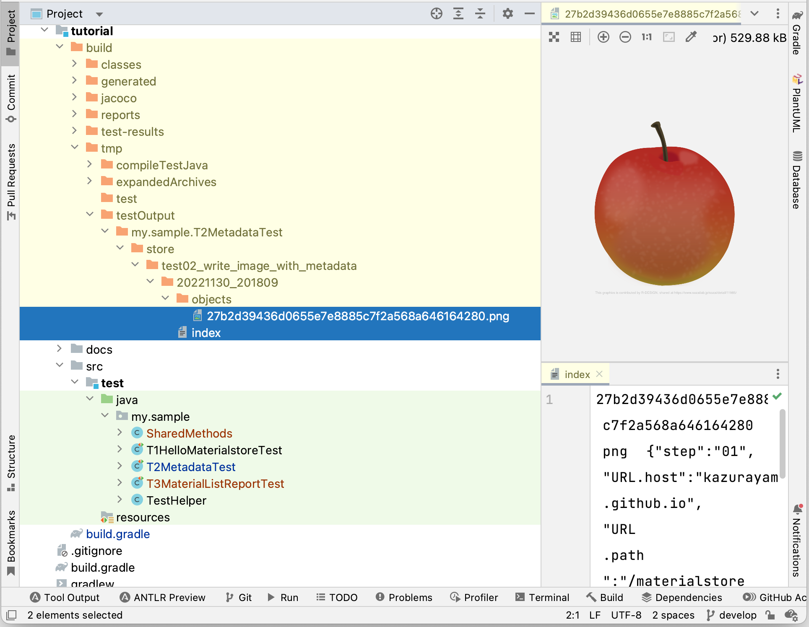

== 2nd example: write an image with Metadata

I will show you next sample code `test02_write_image_with_metadata` of `T2MetadataTest` class.

[source, text]
.T2MetadataTest
----
include::../src/test/java/my/sample/T02WriteImageWithMetadataTest.java[lines=21..60]
----

At the line (10), we create an instance of `java.net.URL` with a String argument "link:https://kazurayam.github.io/materialstore/images/tutorial/03_apple.png[]". You can click this URL to see the image yourself. You should see an apple.

I create a helper class named `my.sample.SharedMethod` with a method `createURL(String)` that instanciate an instance of `URL`.

[source, text]
.createURL(String)
----
include::../src/test/java/my/sample/SharedMethods.java[lines=18..24]
----

At the statement (11) we get access to the URL. We will effectively download a PNG image file from the URL and obtain a large byte array.
The `downloadURL(URL)` method of `SharedMethods` class implements this processing: converting a URL to an array of bytes.

[source,text]
.downloadUrl(URL)
----
include::../src/test/java/my/sample/SharedMethods.java[lines=26..40]
----

The statement (12) invokes `store.write()` method, which create a new file tree, as this:

=== Metadata based on URL & manually created Metadata

the `index` file contains a single line of text, which is something like:

[source,text]
.index
----
27b2d39436d0655e7e8885c7f2a568a646164280	png	{"step":"01", "URL.host":"kazurayam.github.io", "URL.path":"/materialstore/images/tutorial/03_apple.png", "URL.port":"80", "URL.protocol":"https"}
----

Here you can see a JSON-like string which contains several **key:value** pairs. I would call this section as **Metadata** of a material. The metadata was created as specified by the line (13).
[source,text]
----
        Metadata.builder(url).put("step", "01") // (13)
                .build(),
----

The `url` variable is an instance of `java.net.URL`. You should check the https://docs.oracle.com/javase/7/docs/api/java/net/URL.html[Javadoc of `URL`]. The constructor `new URL(String spec)` can accept a string "https://kazurayam.github.io/materialstore/images/tutorial/03_apple.png[]" and parse it to its components: `protocol`, `host`, `port`, `path`, `query` and `fragment`. The `url` variable passed to the `Metadata.builder(url)` call is parsed by the URL class and transformed into key-value pair `"URL.hostname": "kazurayam.github.io"` and others.

Let me show you a few more examples.

The URL string
`"https://duckduckgo.com/?q=materialstore+kazurayam&atb=v314-1&ia=images"` will make the following Metadata instance:

[source]
----
{"URL.host":"duckduckgo.com", "URL.path":"/", "URL.port":"80", "URL.protocol":"https", "URL.query":"q=materialstore+kazurayam&atb=v314-1&ia=images"}
----

The URL string `"https://kazurayam.github.io/materialstore/#first-sample-code-hello-materialstore"` will make the following Metadata instance:

[source]
----
{"URL.fragment":"first-sample-code-hello-materialstore", URL.host":"kazurayam.github.io", "URL.path":"/", "URL.port":"80", "URL.protocol":"https"}
----

=== Order of key-value pairs in Metadata

In the pair of curly braces (`{` .. `}`), the key-value pairs are arranged by the "key", sorted by the ascending order as string. Therefore, in the above example, the key `URL.fragment` comes first, the key "URL.protocol" last.

=== Metadata explicitly specified

Also the line (13) explicitly created a key:value pair: `"step": "01"`.

You can create as many as key:value pairs. Both of key and value must be String (no number, no boolean, no null). The key can be any string. Also the value can be any string. You can use any characters including `/` (forward slash), `\` (back slash), `:` (colon). You can use non-ascii characters, of course. For example: you can create a key-value pair `"番号": "123/456 xyz"`.

You can create any key-value pairs (Metadata) as you like and associate it to the individual material objects. The metadata is stored in the `index` file, which is apart from the material file itself. The image file downloaded from URL is not altered at all. The image is saved as is into the `objects` directory. Adding to it, you can associate a rich set of Metadata with each individual materials. What sort of Metadata to associate? --- it is completely up to you.

