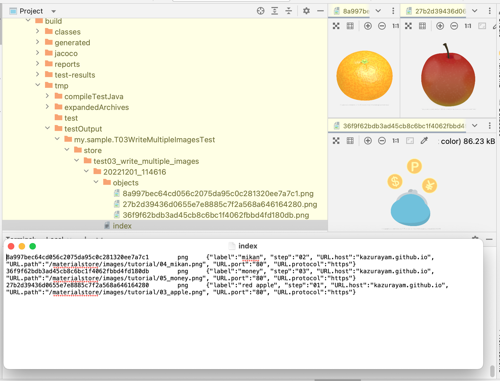

== 3rd example: writing multiple images

Web will make a test case which downloads 3 image files form URL and store them into the store.

[source,text]
----
include::../src/test/java/my/sample/T03WriteMultipleImagesTest.java[lines=18..40]
----

This code calls `SharedMethods.write3images(Store, JobName, JobTimestap)` method. It is implemented as this:

[source, java]
.SharedMethod.write3images
----
include::../src/test/java/my/sample/SharedMethods.java[lines=43..74]
----

This code makes HTTP requests to

* http://kazurayam.github.io/materialstore/images/tutorial/03_apple.png[]

* http://kazurayam.github.io/materialstore/images/tutorial/04_mikan.png[]

* http://kazurayam.github.io/materialstore/images/tutorial/05_money.png[]

and save the image files into a directory inside the store. When you run this test case, you will get a new file tree as follows.

The `index` file will contain 3 lines, one for each PNG image file.

[source,text]
.index
----
8a997bec64cd056c2075da95c0c281320ee7a7c1	png	{"label":"mikan", "step":"02", "URL.host":"kazurayam.github.io", "URL.path":"/materialstore/images/tutorial/04_mikan.png", "URL.port":"80", "URL.protocol":"https"}
36f9f62bdb3ad45cb8c6bc1f4062fbbd4fd180db	png	{"label":"money", "step":"03", "URL.host":"kazurayam.github.io", "URL.path":"/materialstore/images/tutorial/05_money.png", "URL.port":"80", "URL.protocol":"https"}
27b2d39436d0655e7e8885c7f2a568a646164280	png	{"label":"red apple", "step":"01", "URL.host":"kazurayam.github.io", "URL.path":"/materialstore/images/tutorial/03_apple.png", "URL.port":"80", "URL.protocol":"https"}
----

